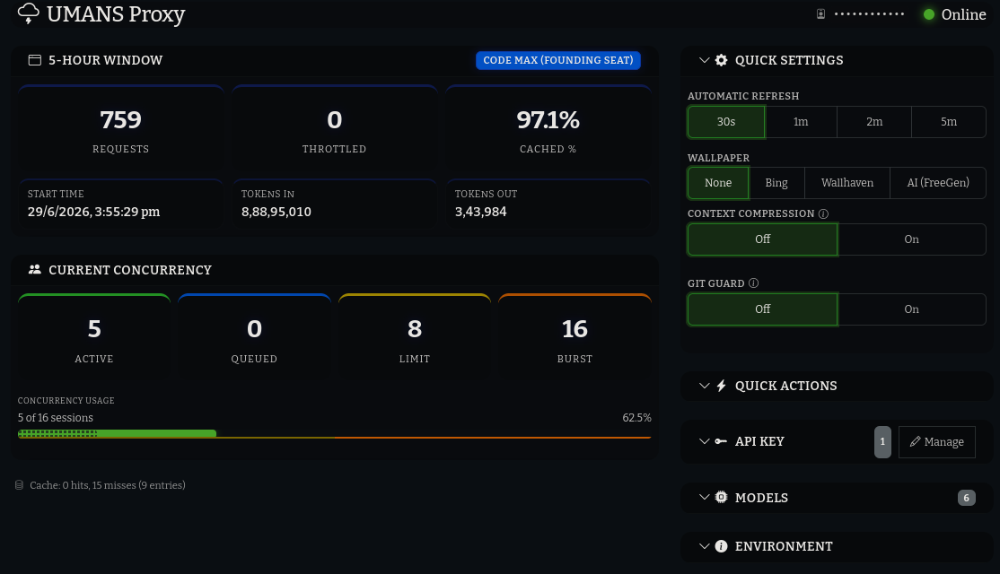

# UMANS-Proxy

OpenAI- and Anthropic-compatible proxy for [UMANS AI](https://code.umans.ai). Zero external dependencies.



## Features

- **OpenAI-Compatible API** — Drop-in for `/v1/chat/completions` and `/v1/models`
- **Anthropic Messages API** — Pass-through for `/v1/messages` (Anthropic-compatible clients)
- **Multi-Key Pool** — Round-robin key pool with unhealthy marking, cooldowns, and persistence across restarts
- **90-Day Usage History** — Usage history endpoint (currently returns empty buckets; dashboard table removed)
- **Response Caching** — LRU cache for non-streaming responses
- **Automatic Upstream Retry** — Retries failed requests on HTTP 500/503 and network failures up to 10 times with escalating backoff, rotating to a fresh key on each attempt
- **Concurrency Queue** — Bounded request queue gated on burst capacity (hard_cap), with soft-limit (limit) and hard-cap (burst) tracking, throttled-503 counter, and rejection when full
- **Dashboard** — Clean UI with usage cards, model management, key management, and configuration
- **Bing Wallpaper** — Daily rotating backgrounds from Bing
- **Wallhaven & FreeGen AI Wallpapers** — Optional backgrounds from Wallhaven or AI-generated by FreeGen
- **Automatic Image-Attachment Limit** — Caps vision/images per request; excess images are pruned oldest-first before forwarding to UMANS
- **Vision Handoff** — Models that can't see images natively (e.g. GLM 5.2) automatically delegate image analysis to a vision-capable model (Kimi K2.7) and inject the text description into the session context
- **Shell-Tool Guard** — When enabled, blocks git commands issued by AI coding agents through the proxy (disabled by default; enabling disables real-time streaming)

## Quick Start

### Prerequisites

- Node.js 18+ or Bun

### 1. Get a UMANS API Key

1. Go to **[app.umans.ai](https://app.umans.ai)** and sign up or log in.
2. Navigate to **API Keys** section.
3. Click **Create API Key** — you'll get a key starting with `sk-...`.
4. Copy this key — it will be used by the proxy.

### 2. Configure the Proxy

Edit `.config/config.json` and set your API key:

```json
{
  "API_KEY": "sk-..."
}
```

Or via environment variable:

```cmd
set UMANS_API_KEY=sk-...
```

### 3. Start the Proxy

```bash
node proxy.js
```

Or on Windows, double-click `start.cmd`.

### 4. Add Models

Edit `.config/config.json` and add the model IDs you want to expose to the `ENABLED_MODELS` array:

```json
{
  "ENABLED_MODELS": ["qwen3-coder", "deepseek-v4-pro"]
}
```

Restart the proxy for the change to take effect.

### 5. Use with Any OpenAI Client

```javascript
import OpenAI from 'openai';

const client = new OpenAI({
  apiKey: 'dashboard',
  baseURL: 'http://localhost:8084/v1'
});

const response = await client.chat.completions.create({
  model: 'qwen3-coder', // must be in your enabled models list
  messages: [{ role: 'user', content: 'Hello!' }]
});
```

### Anthropic-compatible clients

The proxy also exposes `/v1/messages` for Anthropic-format clients:

```javascript
import Anthropic from '@anthropic-ai/sdk';

const client = new Anthropic({
  apiKey: 'dashboard',
  baseURL: 'http://localhost:8084/v1'
});

const response = await client.messages.create({
  model: 'umans-kimi-k2.7',
  max_tokens: 4096,
  messages: [{ role: 'user', content: 'Hello!' }]
});
```

## Dashboard

Open **http://localhost:8084** in your browser.

### 5-hour Window Card
- **Requests / Throttled / Cached %** — Current window usage with throttled (503 queue-full) count
- Detail grid: Start Time, Tokens In, Tokens Out

### Current Concurrency Card
- 4 stat cards: **Active** (green), **Queued** (blue), **Limit** (soft, yellow), **Burst** (hard cap, orange)
- Progress bar with solid fill (proxy active) and dotted overlay (upstream concurrent)
- Percentage scales to 100% at soft cap, 200% at hard cap

### Quick Settings (expanded)
- **Automatic Refresh** — 30s / 1m / 2m / 5m (=298s) interval selector
- **Wallpaper** — None / Bing / Wallhaven / FreeGen (AI-generated)
- **FreeGen Prompt** — Custom prompt for AI wallpaper generation
- **Context Compression (Sleev)** — Toggle Sleev context-compression gateway
- **Git Guard** — Toggle shell-tool guard (blocks git commands; disables real-time streaming when enabled)

### Quick Actions (collapsed)
- Health check, connection test, manual refresh, restart proxy

### API Key (collapsed)
- Key pool display with status badges; manage keys via modal

### Models (collapsed)
- View and toggle models from the catalog

### Environment (collapsed)
- Runtime, Port, Started At

### Header Bar
- User ID (click-to-reveal, masked by default) and online status indicator

## Vision Handoff

Some UMANS models (e.g. `umans-glm-5.2`, `umans-glm-5.1`) are advertised with `supports_vision: "via-handoff"` — they cannot process images natively. The proxy transparently bridges this gap:

1. When a request to a `via-handoff` model contains images, the proxy extracts them (OpenAI `image_url` and Anthropic `image` parts, including nested tool-result blocks).
2. Each image is sent to the **handoff model** (default `umans-kimi-k2.7`) with an analysis prompt.
3. Images are analyzed in parallel and replaced in-place with `{type: "text", text: "[User pasted image]\n<description>"}` blocks.
4. The modified payload (now text-only) is forwarded to the originally requested model.

The handoff applies to both the OpenAI (`/v1/chat/completions`) and Anthropic (`/v1/messages`) paths. On the OpenAI path it runs after the cache check, so cache hits skip the handoff entirely.

**Config keys:**

| Field | Description | Default |
|---|---|---|
| `VISION_HANDOFF_ENABLED` | Toggle the handoff for all `via-handoff` models | `true` |
| `VISION_HANDOFF_MODEL` | Vision-capable model used to analyze images | `umans-kimi-k2.7` |
| `VISION_HANDOFF_PROMPT` | Custom analysis system prompt (empty = built-in) | — |

The built-in prompt instructs the handoff model to describe all visible elements, transcribe any text, and explain the context of the image.

## API Endpoints

| Method | Path | Description |
|---|---|---|
| `GET` | `/healthz` | Proxy health check |
| `GET` | `/v1/models` | OpenAI-format model list with pricing and context length |
| `POST` | `/v1/chat/completions` | OpenAI-format chat completions |
| `POST` | `/v1/messages` | Anthropic Messages API (pass-through to upstream) |
| `GET` | `/api/config` | Get proxy configuration |
| `POST` | `/api/config` | Update proxy configuration |
| `GET` | `/api/validate` | Validate API key |
| `GET` | `/api/models` | List enabled models |
| `GET` | `/api/umans/usage` | UMANS usage data (supports `?fresh=1` to bypass cache) |
| `GET` | `/api/umans/usage-history` | Usage history (returns empty buckets) |
| `GET` | `/api/umans/concurrency` | Concurrency sessions, limit, hard_cap, active count & queue depth (supports `?fresh=1`) |
| `GET` | `/api/umans/user` | UMANS user status (stub) |
| `GET` | `/api/keys` | List API keys |
| `POST` | `/api/keys` | Add/update/delete API keys |
| `GET` | `/api/cache` | Cache stats |
| `DELETE` | `/api/cache` | Clear cache |
| `GET` | `/api/bg` | Daily Bing wallpaper |
| `GET` | `/api/bg-wallhaven` | Random Wallhaven wallpaper |
| `GET/POST` | `/api/bg-freegen` | FreeGen AI wallpaper generator (GET returns cached image; POST `{prompt, ratio, wait}` starts/waits for generation) |
| `GET/POST` | `/api/sleev` | Sleev context compression toggle and status |

## Configuration

`.config/config.json` supports:

| Field | Description | Default |
|---|---|---|
| `LISTEN_ADDR` | Proxy listen address | `127.0.0.1:8084` |
| `UPSTREAM_BASE_URL` | UMANS API URL | `https://api.code.umans.ai/v1` |
| `API_KEY` | UMANS API key (`sk-*`) | — |
| `KEYS` | Array of additional API keys for the key pool (name + key) | `[]` |
| `REQUEST_TIMEOUT` | Upstream request timeout | `15m` |
| `CACHE_TTL` | Response cache TTL | `60s` |
| `CACHE_MAX_SIZE` | Max cached responses | `100` |
| `CACHE_ENABLED` | Enable/disable cache | `true` |
| `ENABLED_MODELS` | Array of model IDs to expose | `[]` |
| `MODEL_DISPLAY_NAMES` | Custom display names per model | `{}` |
| `API_KEYS` | Array of allowed proxy API keys (auth) | `[]` |
| `OVERRIDE_CONCURRENCY` | Override concurrent sessions value (0 = auto-detect from API; capped to min of override and upstream hard_cap) | `0` |
| `MAX_IMAGES` | Maximum image attachments per forwarded request; oldest images are dropped first | `9` |
| `SHELL_TOOL_GUARD` | Enable shell-tool guard to block git commands in tool_call responses (disables real-time SSE streaming when enabled) | `false` |
| `VISION_HANDOFF_ENABLED` | Enable image handoff for vision-incapable models | `true` |
| `VISION_HANDOFF_MODEL` | Vision-capable model used to analyze images during handoff | `umans-kimi-k2.7` |
| `VISION_HANDOFF_PROMPT` | Custom analysis prompt for the handoff model (empty = built-in) | — |
| `wallpaperSource` | Dashboard wallpaper source: `none`, `bing`, `wallhaven`, or `freegen` | `freegen` |
| `FREEGEN_PROMPT` | Default prompt used by FreeGen wallpaper generator | `epic cinematic landscape, mountains at sunset, vibrant colors, ultra detailed, 16:9 wallpaper` |

## License

This project is licensed under the MIT License — see [LICENSE](LICENSE) for details.
